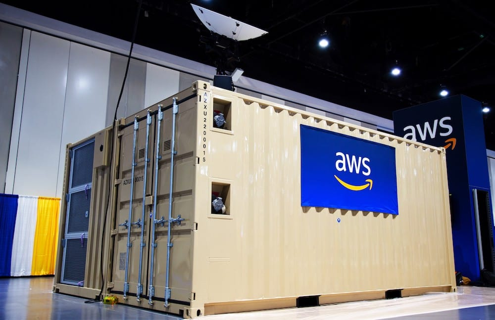
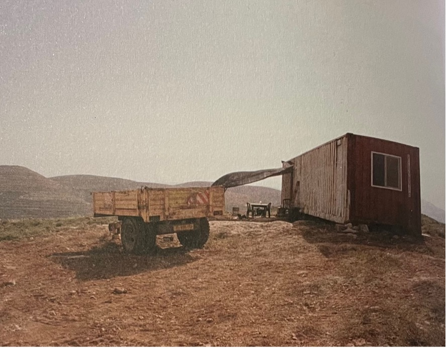

# Introduction

“Essay” originates from the old French word “Essai,” whose direct
translation is “trial, attempt.” The two essays combined here both
depart from a master’s thesis. A thesis is a trial, but one that
requires strict models and a firm destination. It attempts to overcome
insecurity through claims to universality or truth. It promises
discovery, but a format guarded by so many regulations can only ever
open itself so much to the unknown. Reintroducing the *essai* into our
texts for this *Network Notions* was a challenging undertaking. Theodor
Adorno, in “The Essay as Form,” reminds us that the essay reflects “a
childlike freedom” and always needs play and luck.[^00book1_1] He writes: “The
way in which the essay appropriates concepts is most easily comparable
to the behavior of a man who is obliged, in a foreign country, to speak
that country's language instead of patching it together from its
elements, as he did in school.”[^00book1_2] For this publication, we attempted
to forget the dictionary to enter the essay. The process happened
somewhat backwards. For our theses, we were first tasked with
formalizing ideas into specific models meeting academic standards, only
to then attempt to subvert those same standards from within. Trying is
the point, though, or so the essay form tells us.

To write about fast-changing technologies and the conditions they give
rise to is to accept a certain tension. Moving, fleeting, and breaking
digital bodies resist the writing form. The essay, however, opens up
more possibilities. Thoughts, observations, and interpretations do not
have to be proven. It is composed of precariously dependent concepts
that, for the time and place of the essay, become neighbors. They can
live in harmony, but they can also quarrel. Reinserting these processes
lies at the heart of this publication.

At the World Economic Forum in 2015, Google chairman and ex-CEO Eric
Schmidt promised that “the Internet will disappear” into our
environments. Since then, we’ve seen the slow dissolution of the digital
into our lives. Whether it’s the design of every new iPhone, which keeps
getting smoother and thinner, or the smartification of household
appliances, increasingly fragmented forms of technology have permeated
our material realities. Technology today operates inconspicuously and
smoothly, dissolving into our surrounding environments. For dissolution
to be possible, the technological object must first become modular,
flexible, and malleable. But dissolution of the internet does not only
occur through permeation of the material; it is also a cognitive shift.
Human cognition is being supplemented (supplanted?) by technologies that
think alongside us. Technology isn’t comprised of microchips and
electricity; it has become a feeling, a vibe. This process is slow and
gradual, operating under the veil of innovation. It is steadfast and
naturalized: we innovate for the sake of innovation. But at what point
do we stop and question the course of technological process? At the
point when humans become obsolete? Does technology leave any space for
human cognition and temporality? What do life and death mean in the
digital age? These are the questions motivating our text, and the
moments we seek to explore.

As humans, we increasingly adapt to the mutability and formlessness of
technology. Pervasive technologies have entered every aspect of human
activity. Ranging from social life, to medicine to the military, both
the industries that preserve life and destroy life are mediated through
technologies on a planetary-scale. And while dominant imaginaries about
data infrastructure continue to shift, it remains crucial to demystify
the material realities that underpin our lives. While big corporations
keep growing with seemingly endless resources and capital, human
realities are increasingly marked by precarity and a sense of doom.
There is little space left for agency and manoeuvring when going against
systems that cultivate the myth of their own infinity. The reinsertion
of materiality, of humanness, and eventually of death into the
understanding of technologically-mediated life can also, in turn,
provide us with counternarratives and alternative ways of being. And so
we assert this human position, which seems now more than ever to be at
odds with current modes of power.

As researchers at INC, we are interested in the flattened, muted, and
everydayness of technology and the digital. We want to challenge
routineness and critically interrogate what is often deemed banal by
other discourses. We seek to undermine the imaginary of dematerialized
technological life, which is so often encountered in mainstream
narratives.

The following texts emphasize urgency and fast-theory, taking on
different cases, questions, and approaches while underscoring the
importance of reintroducing materiality back into technology.

# Somewhere Between Death and Life: notes on temporality, net art and glitch 

### Mela Miekus 

> “Obsolescence never meant the end of anything, it’s just the
> beginning.” – Marshall McLuhan

This is the age of the perpetual-now that pushes death into oblivion.
Oversaturation, overstimulation, and overconsumption are the slogans of
the day, driving society into a general overload that leaves few
survivors behind. Everything happens in the *now,* but this *now* is not
an embodied present moment; rather it is a hyper-*now* that scatters
into many parallel *nows*. The *now* is essentially *everything
everywhere all at once*. It is the life you are living in front of you,
but also the one on your Instagram; the one at your office, as mutch as
that of your avatar in your favorite video game or that of your online
dating profile. Bombarded with images, information, sensation we can no
longer cope. We depart from our bodily boundaries and into the mediated
hyperabyss. Within this cloud-like environment (partially owned by Meta,
Apple, Alphabet and Microsoft) notions like embodiment, reality, truth,
or presence become strategically eliminated. All ends are removed. The
world is your oyster and its shell is shut. All is possible but nothing
is felt.

Bodily limits are constantly renegotiated: modern medicine keeps your
heart beating thanks to an external device, your skin feels incomplete
without the Apple watch that monitors your stats, and you cannot leave
the house without noise cancelling headphones. Everything has been blown
out of proportion. Is the sheer notion of an end still possible? What
about death? What does death mean in a culture of the perpetual now? Has
it, too, been blown up? Have we, culturally, moved past death? If so,
what does this mean for human and non-human bodies and their
relationship to their own disappearance?

The erasure of death from everyday life was one of modernity’s most
ambitious representational projects.[^00book1_3] In, *The Symbolic Exchange and
Death* (1976), Jean Baudrillard writes: “There is an irreversible
evolution from savage societies to our own: little by little, the dead
cease to exist. They are thrown out of the group’s symbolic
circulation.”[^00book1_4] Cities no longer have space for the dead: physically,
as cemeteries are pushed to the peripheries, and culturally, as death is
increasingly removed from our mental horizon. Modern times situate death
as a deviancy and delinquency.[^00book1_5]

Michel Foucault’s theory of *bio-power* holds special resonance here.
Foucault traced the history of power, showing that death once demarcated
its limits: kings used to kill the disobedient as the ultimate
punishment.[^00book1_6] After the 17th century, societies adopted a different
rationale; it became far more advantageous to manage populations and
keep people alive.[^00book1_7] Power’s locus and operationality thus shifted:
from putting people to death to allowing them to live. Life came to be
regulated through the postponement of death, with an emphasis on
improving the productivity of the population, marking the shift toward a
capitalist society. As modernity spread, so did the exclusion of death
from life–it was no longer normal to be dead.

Today, this logic is designed into the digital: death is made invisible,
obfuscated, and abnormal. Every social media design eliminates the
concept of an end by placing users in the infinite scroll, profiles
outlive users, and Billionaires are busy finding techno-solutions to
cheat death.[^00book1_8] Where the boundaries between life and its technological
extensions blur, traditional conceptions of death no longer hold. There
is a necessity for a rethinking of death and a reinstitution of its
processes into the social realm. While this reinsertion is most
pertinent to humans made of blood and flesh, it is also pertinent to
objects and all that lies between.

Judith Butler in *Precarious Life: The Powers of Mourning and Violence*
(2004) examines the politics of loss and hierarchies of grievability.
Butler questions who is classified as grievable and who is not. Who has
the privilege of being publicly mourned? And if someone does not have
that privilege, were they ever alive?[^00book1_9] These questions are already
disruptive and revealing of death’s complex nature but gain even more
urgency when expanded to include non-human beings. I am inspired by a
meeting with the Dutch artist Rosa Menkman, where we spoke about the
difficulty of thinking about making art in the backdrop of political
crises and wars. Menkman reflected about her future as an artist and
quickly turned to her virtual figure that narrates many of her net
artworks, the *Angel of History*. If Menkman were ever to stop making
art, would that mean the *Angel* would also have to die, or worse, be
killed? Killed by her? Would she then be killing a part of herself? And
if the *Angel of History* were to die, what would that death mean? This
led me to more questions; how do we mourn bodies that exist on the brink
between life and death? How do we think about death when encountering
digital personas stemming from net artworks such as Menkman’s *Angel of
History*? These figures are often dismissed as not real and therefore
not alive. Yet how can figures be unreal and non-living yet capable of
death?

##Net Art 

Net art, understood as “art based in or on internet cultures” is always
dependent on live technologies, networked infrastructures, and social
entanglements.[^00book1_10] While the anatomies and conceptual underpinnings may
take very diverse forms, net artworks stem from a common interest: the
net. “Network” precedes “net,” with dictionaries defining it as a
large, interconnected system that allows for communication and/or
exchange between its components.[^00book1_11] Annet Dekker discusses these terms
in the context of net art, suggesting the following definition: “A
network consists of linked structures and distribution systems that
connect traces, projects, and people.”[^00book1_12] She traces the etymology of
the word “net,” which initially referred to physical constructs such as
netting, networks, spider webs, or meshes used for capturing, as well as
objects characterized by being knotted or interwoven.[^00book1_13] Over time,
the concept expanded to encompass references to complex structures,
signifying interconnected systems. By 1972, the term was applied within
the context of computers, marking its integration into technological
discourse. Subsequently, in the 1980s, “net” was further extended to
describe humans and their relations.[^00book1_14]

Net art is always contingent on networks and those are always contingent
on being able to move, grow, and break. This condition brings Josephine
Bosma to argue that net art is always on the brink of obsolescence and
cannot be understood without the gaze of its mortality.[^00book1_15] Nothing
changes as fast as hardware and software, and so artworks made up of
networks, code, files, images, and data are, by their very nature,
precarious. Following Butler, precariousness is not an exception but one
of the conditions of existence itself.[^00book1_16] It reveals the ties that
connect us all, and that those ties can come undone. Death then reveals
those ties unlike anything else; an “I” cannot lose a “you” and return
to how it was before, because the “you” was part of that “I.” Net art
already presupposes and assimilates the processual breakdown of the
multiple ties that compose it. These works are living systems often
relying on unstable and moving media like websites whose domains must be
periodically paid for, or digital archives requiring ongoing attention.
Removing it from these relations removes it from the “net” in net art.
This art, unlike static forms, survives only through its embeddedness in
these ongoing systems of relation. The potential for loss of control—for
glitch, for collapse, for death—is a prerequisite for net art’s life.

Rather than seeing disappearance as a problem to be solved, I explore
how loss, disintegration, and messiness might be understood as
productive forces. This approach requires understanding net art’s life
through an analytic of death. By using death as an analytical framework,
I ask: What can be gained from taking death as a method and generative
process? Can the process of death open space for alternative ways of
being that oppose current powers of stasis? What implications might this
have for the way we understand net artworks and, more broadly,
communities and technologies?

## Building Through Death

As society moved rapidly into the networked era where computers, media,
and technology dominate our daily routines, the relationship between
life and death radically transformed. Discussions of immortality take on
a new level of plausibility, particularly in light of the eugenic and
transhumanist discourse flourishing in Silicon Valley. Visions of tech
billionaires freezing their bodies in hopes of future resurrection or
developing technologies to preserve (at least parts of) their existence
no longer seem distant or abstract. Think millionaire entrepreneur Bryan
Johnson and his anti-death campaign, best exemplified through his
website:
*dontdie.bryanjohnson.com*.
Greeted by the slogan “DON’T DIE,” the audience is offered a glimpse
into his rather ambitious project. The site states:

> We are at war with death and its causes.
>
> We are building towards an infinite horizon.
>
> We are fighting for the freedom to exist as long as one chooses.
>
> Why? Because we have things to do tomorrow. And tomorrow’s tomorrow.
> Until we no longer want tomorrow.[^00book1_17]

What Johnson’s self-proclaimed “community" proposes is quite simple:
let’s cheat death together, *join or die*. This example may seem extreme
but given the open prevalence of transhumanist medical technologies and
cryogenics only available to the rich, one can assume there are several
Johnson-esque projects unfolding behind closed doors. This context makes
it ever more necessary to situate death within the mediated landscape
and examine its relationship with technology.

 

François Bonnet, in *After Death* (2020), considers precisely the
digital context and its relationship to death. Bonnet begins his book by
presenting the concept of *decoupling* as a key mechanism in today’s
political order. He sees humans as composed of two *becomings*. He calls
the first one *finite-being*: the fact that humans are bound.[^00book1_18] We
are bound by our bodily limits and boundaries, such as the skin that
protects us from the outside; bound by relations to the external world;
and bound in the sense that our being is finite and will come to an end.
He explains that the finite character of our existence necessitates a
constant building of oneself based on that which falls outside oneself.
Bonnet writes: “to delimit the space and time of one’s existence is
immediately also to circulate, move, and orient oneself externally and
in time. If I am not omnipresent, if I am not eternal, then I can move
and become—or rather, I cannot avoid moving and becoming.”[^00book1_19] Thus,
practicing and living with an awareness of human finitude allows space
for fluctuation and an ongoing process of (re)orientation that
delineates our being, or, in Bonnet’s words, our becoming.

The second becoming is an effect of being a finite-being in an infinite
world that makes countless relationships, sensations, affects, and
events possible. Bonnet calls this the *projected-being*: a being that
is inscribed with an expanse into space and time, a being that reaches
beyond our borders. This can be better understood through thinking about
one’s online existence: social media profiles extend beyond our bodily
boundaries (i.e. skin.) but are still (usually) seen as parts (or
extensions) of the self. Another example would be religious practices
that foster the belief of an afterlife, extending life beyond the
borders of death.

Bonnet points out that “nothing is possible without this coupling of
constrained being and immeasurable expanse” and it is a duality that
always accompanies humans.[^00book1_20] A problem emerges when these two
becomings “can no longer hold together,” and one becomes swallowed by
the other, a process he calls decoupling.[^00book1_21] The process of decoupling
entails a split between the finitude/expanse duality which within
today’s digital landscape gives the latter the upper hand. Bonnet
exemplifies how projected-being begins dominating lives through the idea
of sacrifice: the desire to give something up for a greater cause, one
that extends our influence beyond our borders and surroundings.

Bonnet argues that the sacrifice that extends our finite-being into the
boundless universe is labor. Individuals give up their time and energy,
often for the benefit of the firm that employs them, trading their work
for the growth of an entity that reaches far beyond themselves. Bonnet
concludes: *“*\[sacrifice\] heralds the final stage in the disjunction
between two becomings, and the potential elimination of one in the name
of the other.”[^00book1_22] He exemplifies the potential consequences of the
elimination of our finitude through the story of a young Taiwanese man
who died from gaming at an internet café for 48 consecutive hours,
sacrificing bodily needs and forgetting its limits in order to stay
connected.[^00book1_23] One can also think of “gooners,” individuals who
masturbate to an endless stream of digital pornography, they postpone
climax for as long as physically possible (often harming their bodies in
the process) to keep consuming content. Subtler examples, such as
severely worsened attention spans due to an over-consumption of
fast-paced stimuli like TikTok also visualize this process.

##Going Online 

When considering how it is that we can no longer situate ourselves in
our bodies, in our own finitude, in our own space and time, it is
evident that technology plays a crucial role. Bonnet highlights that the
last 50 years have been marked by an information economy, established
thanks to the rise of telecommunication technologies.[^00book1_24] High-paced
globalization allowed for global connectivity via diverse technologies,
simultaneously creating a culture where people can (and today should)
always be available, reachable, and updated. News, events, codes, and
images are constantly in a flow of consumption, extending human
awareness, perception, and sensation far beyond one’s bodily and
immediate-community borders. Bonnet shows how the rise of technologies
and the accelerated information flow engendered a new approach towards
information and thereby towards the world.

When speaking about a shift toward constantly connected information
culture, it is key to consider the rise of the internet along with its
different phases. As the first computers began to gain popularity
throughout the 1970s, the web provided an unprecedented possibility to
be (almost) instantly connected to people and communities that would
otherwise be beyond one’s reach. The beginning of internet cultures that
flourished in the 1990s was characterized by community and network
building.[^00book1_25] Further, it was still an online realm of messiness and
play, where a user’s online persona did not have to correspond to their
offline persona. The network-based internet began shifting into a more
structured and centralized place, commonly referred to as *Web 2.0*,
that accompanied the paradigm shift which followed 9/11.[^00book1_26] Anonymity
started being seen as the ultimate danger, which forced higher physical
as well as online surveillance. Online personas were forced to
correspond to offline personas. As explained by de Zeeuw and Tuters:

> The rise of the mainstream surface web of social media platforms in
> the early 2000s can thus be understood as an attempt to transform what
> was, at that moment, perceived as the problematic nature of the early
> internet, into a more consumer-and business-friendly environment that
> would allow for the creation of well-defined, high-resolution data
> doubles linked up to users’ real identities.[^00book1_27]

With web 2.0, tracking IDs, cookies, personalized ads, profile-focused
social media, and digital surveillance became the new markers of the
online realm. Key players began quickly emerging and spreading their
centralization quest, best exemplified through the company Meta, which
now encompasses Instagram, Facebook, Messenger, Threads, and
WhatsApp.[^00book1_28] In today’s globalized economy, there are fewer places
that remain beyond the platforms' reach; in 2025, Meta apps reached 3.54
billion daily active users.[^00book1_29] Platform technologies have slid into
almost every aspect of our daily life—work, school, pleasure, love, and
health—making it almost impossible to simply “go offline.” As Lovink
puts it, “we’ve reached a point where we can call out the platform as a
disciplinary machine, in line with the clinic, school, factory, and
jail.”[^00book1_30] And, as every disciplinary machine, the platform extends its
reach into the realm of both life and death.

##The Victory of the Present

Bonnet argues that two states have emerged alongside the rapid
acceleration of the information era: amnesia and anesthesia.[^00book1_31] In an
environment where users are constantly bombarded with images, news, and
experiences, it becomes nearly impossible to fully register or retain
any one event (amnesia). Information is continuously remixed and
replaced, making each experience fleeting and forgettable. This endless
cycle of consumption leads to desensitization (anesthesia): an
overstimulation of the senses that prevents them from unfolding
naturally over time. As Bonnet explains, “the barely concealed dream of
these combined strategies is to reduce the sensory horizon to a single,
monopolistic stimulus that can be repeated as many times as necessary
before a ‘new’ avatar with the same qualities arrives—as promptly as
possible—to succeed it.”[^00book1_32] Bonnet suggests that amnesia and
anesthesia are not accidental byproducts of the information economy but
rather carefully designed mechanisms of control. By accelerating the
flow of events, experiences, and stimuli, these mechanisms effectively
manipulate what remains the most uncontrollable aspect of human life:
time.

This acceleration traps users in a state of constant presentness.
Events, sensations, and images do not follow a natural trajectory but
are instead remixed and replaced before they can fully unfold. As a
result, their finitude is erased. Bonnet’s concept of decoupling becomes
especially relevant here, as it highlights how projected-being
flourishes in this hyper-saturated information economy. In this
framework, temporality itself is transformed: the past is constantly
overwritten, and the future is collapsed into an ever-intensifying now.

Bonnet calls this entrapment within a constantly updated present moment\
the *hyperpresent* and illustrates it through the well-known phrase
*carpe diem*—Latin for "seize the day." Originally, this expression
signified an acceptance of life’s impermanence, a reminder to savor each
moment in light of our inevitable mortality. However, in the
contemporary digital economy, Bonnet argues, this notion has been
co-opted to serve a different agenda. The present moment is no longer a
space for becoming but rather a locus of immediate gratification and
consumption. This logic is particularly evident in the rise of
hyper-productivity culture. Figures like Andrew Tate and other grindset
influencers push an extreme version of *living in the moment*, where
every second must be optimized for maximum efficiency. One hustlepreneur
has, in his words, actually managed to condense time itself. In the time
us weak mortals live one twenty-four-hour day, he lives three:

> So I’ve compressed and condensed time; I’ve bent it. My day is 6 a.m.
> to noon, and I’m not crazy—you’re crazy for thinking it takes 24
> hours, just like some dude in a cave did 300 years ago. My second day
> starts at noon and goes till 6 p.m.—that’s day two—and then the next
> day is 6 p.m. to midnight. What I’ve done now is I have changed and
> manipulated time. I now get 21 days a week. Stack that up over a
> month—I’m gonna kick your butt. Stack it up over a year—you’re toast.
> Stack it up over five years—my entire life is different than it would
> have been otherwise.[^00book1_33]

Considering the proliferation of such “life hacks,” it makes perfect
sense that today’s general state is marked by an anxiety of not doing
enough. Previously autonomous territories become steadily infiltrated by
the hyperpresent. Sleep, a biological state that most closely resembles
death, offers a clear example of how this process unfolds: it is
increasingly optimized and technologically mediated. Beginners use apps
to monitor their sleep cycle, while those more invested can even get
smart beds. States that require logging off—especially in its most
permanent sense—are visibly under attack. Consider, for instance, how
difficult it is for users to delete their social media profiles. The
“delete profile” button is strategically hidden behind several
intermediary steps. The discouragement from exiting is a design choice.

One can begin to understand the hyperpresent’s ability to extend its
reach into all temporal planes, effectively reshaping both our
perception of the past and our imagination of the future. Media theorist
Richard Grusin explores this phenomenon through his concept of
*premediation,* which describes how media technologies use the mediation
of the present to exert control over the future.[^00book1_34] In an era of
continuous information flow, society is inundated with so many images
and narratives that we have, in a sense, already “seen” versions of what
is to come. Possible futures are entangled within the horizon of the
now, leaving little room for manoeuvring. Linking back to Bonnet, these
processes intensify the functions of amnesia and anesthesia. By locking
society in an all-encompassing present, the hyperpresent minimizes the
chance for disruption and change. As Bonnet explains; “but the
hyperpresent, as much as it can, catches and suspends the unfolding of
time in order to make of it a dead time. The toxicity of the
hyperpresent lies precisely in this suspension of becoming—an
extinguishing of temporal resonances that leads to the negation of the
living being itself.”[^00book1_35] Clearly, the hyperpresent does more than just
accelerate time; it freezes it. It creates a paradoxical form of
stillness, where the illusion of constant movement conceals a deeper
stasis. In this state, human beings become trapped in the constant now.

This temporal entrapment has profound implications for our understanding
of death. The hyperpresent does not merely alter our perception of time
but it actively pushes death into oblivion. If the digital sphere
dissolves all boundaries and replaces linear temporality with an endless
loop of instantaneous updates, then the concept of an *end* itself
becomes unthinkable. The limits and finitude of human existence are
eroded by the perpetual connectivity, where every moment is instantly
replaced by another, actively eliminating death from society’s mental
horizon. This can be exemplified through the vastness of the feed scroll
that quite simply never ends, in turn furthering the user's desire for a
consumption that is not allowed to run its course.

The abstraction of death is not without its challenges, particularly
within the context of platform capitalism. The very same technologies
that work to render death distant and unreal also confront the
complexities of managing it. Tamara Kneese’s book *Death Glitch* (2023)
investigates the techno-solutions that Silicon Valley has developed to
handle death, offering valuable insights into how the technology
grapples with the very thing it seeks to obscure. Her observations are
key to understanding the tensions that arise when platform capitalism,
which thrives on the myth of the infinite, encounters the finality and
messiness of death.

## Death at Silicon Valley

Kneese shows how at an age where our digital footprints are increasingly
seen as intimately interlaced with our offline existence, the issue of
digital death has grown highly complex. Her study begins by
demonstrating the proliferation of online mourning practices such as
using deceased people’s social media pages as shrines. Using Facebook as
a case study, Kneese reveals the platform’s ongoing struggle with
managing the profiles of dead users.[^00book1_36] On one hand, inactive profiles
generate less revenue due to reduced engagement and ad traction. On the
other hand, deleting these accounts has repeatedly led to public outrage
and distress among the affected friends and family members. In response,
Facebook has attempted various solutions, including automatic
memorialization features, yet these efforts have often been clumsy and
inadequate. The platform has mistakenly classified living users as
deceased due to inactivity, while its automated systems have
insensitively resurfaced memories of lost loved ones in annual recap
videos.[^00book1_37] These missteps illustrate that death remains profoundly
difficult to design for within platforms.

At the core of Kneese’s argument is a key tension she terms *platform
temporality*: the conflict between individual immortality and platform
ephemerality.[^00book1_38] Kneese writes “Silicon Valley tech companies may talk
about the future, but their bottom line is tied to short-term returns on
a quarterly basis.”[^00book1_39] While there is a strong desire to find ways for
technologies to outlast their makers, platforms are not built to sustain
permanence. Their infrastructures are shaped by the rhythms of corporate
interests, technological upgrades, and the ever-accelerating cycle of
digital consumption. The utopian promise of digital immortality is thus
at odds with the platform market dynamics and the ephemerality of
technologies. In this sense, the hyperpresent that removes death as far
as possible is also embedded into the very structures of online
platforms that struggle to find productive solutions to the messiness of
death.

## Death as Radical Erratum

Kneese’s research leads her to the overarching argument of her book:
death is a glitch in the system for techno-solutionism. The
relationality, the chaos, and the unforeseeable encounters that death
offers mark it as a disturbance to power systems. Her analysis draws
from queer, feminist, and trans media studies that define glitches as
momentary failures of a system that can reveal its internal
shortcomings. Legacy Russell coins the term *Glitch Feminism*, which she
defines as follows:

> Glitch Feminism, however, embraces the causality of ‘error,' and turns
> the gloomy implication of glitch on its ear by acknowledging that an
> error in a social system that has already been disturbed by economic,
> racial, social, sexual, and cultural stratification and the
> imperialist wrecking-ball of globalization— processes that continue to
> enact violence on all bodies—may not, in fact, be an error at all, but
> rather a much-needed erratum.[^00book1_40]

Death, in Kneese’s argument, poses potential for this much-needed
erratum in that it reveals the contradictions between long-term care and
tech-capitalist strategies. Kneese is not alone in her observations;
Baudrillard and Bonnet, though using different means, also build their
perspective for opposing hegemonic structures with death at the
forefront.

Jean Baudrillard posits an understanding of labor power as instituted on
death. He employs the analogy of the master and the slave to illustrate
this relationship. The prisoner of war is captured and spared but why is
the prisoner spared? In order to work, thereby becoming a slave.
Baudrillard conceptualizes labor as *deferred death*; one’s death is
postponed in exchange for one’s labor. He writes, “does capital exploit
the workers to death? Paradoxically, the worst it inflicts on them is
refusing them death. It is by deferring their death that they are made
into slaves and condemned to the indefinite abjection of a life of
labour.”[^00book1_41] Baudrillard consequently conceptualizes the opposition to
labor not as a mere absence of labor, but a violent death. Speaking in
symbolic terms, Baudrillard is arguing that the capitalist system is
built on symbolic stakes. In his view, the symbolic reinstatement of
violent death represents the ultimate opposition to labor; notably
writing: “If power is death deferred, it will not be removed insofar as
the suspension of this death will not be removed.”[^00book1_42] The most radical
response, then, is to reintroduce death into the stakes. Baudrillard
uses the May 1968 barricades as an example, suggesting that through the
reinstatement of violent death within the realm of possibility and
symbolic exchange, power can lose its footing.[^00book1_43]

Bonnet’s analysis takes a similar path, emphasizing the necessity of
reinstating death into life. He illustrates how contemporary society
systematically removes melancholy, nostalgia, and the fear of death from
our lives, and asserts that these sentiments are essential.[^00book1_44]
Nostalgia compels one to seek what is no longer present, thereby
highlighting the finitude of our existence: we once were or possessed
something that is no longer. It simultaneously evokes the transcendental
aspect of our being in the world. This dual recognition, in turn,
facilitates the necessary process of becoming, wherein various qualities
alter and redefine one another in a continual, constitutive process.
Bonnet argues that such becomings open the possibility of asynchronous
spaces, which he defines as “a multiplicitous space—an ensemble of
space-time localities, isolated by definition, patchy, secret, and
hidden from the law of instantaneity,” and, by extension, shielded from
the dominance of the hyperpresent.[^00book1_45] He posits that living in closer
proximity to mortality, finitude, and death is necessary to escape the
grip of eternal stasis.

If power has persistently sought to manage, obscure, or defer death,
then reinstating death into our horizon is a necessary intervention.
While many contemporary power structures, such as platforms, tech
giants, and political leaders, have yet to develop a definitive strategy
for overcoming death’s inevitability, its messiness makes it irreducible
to simple administration. Death, by its very nature, reveals networks
and interdependencies that extend beyond the individual.

## Glitch = Death

Having built this understanding of death I would like to turn to an
analysis of Rosa Menkman’s net practice, with the focus on glitch as a
mechanism of generative death. Rosa Menkman works with a variety of
media but consistently engages with the politics of the computer.
Research always acts as a starting point for Menkman’s practice, and
*glitching* has been one of its key themes. At the initial layer, a
glitch is a noise artifact: a disruption that is caused by “errors in
both analog and digital media” but Menkman expands the glitch beyond its
technical iterations.[^00book1_46] In her publication *The Glitch Moment(um)*
(2011), Menkman conceptualizes the glitch as an “(actual and/or
simulated) break from an expected or conventional flow of information or
meaning within (digital) communication systems that results in a
perceived accident or error.”[^00book1_47] She emphasizes that it “occurs on the
occasion where there is an absence of (expected) functionality, whether
understood in a technical or social sense.”[^00book1_48]

Glitch becomes a tool in Menkman’s work, and as with every tool it
serves a specific purpose even if the effect cannot be preplanned.
Glitching—in the way it exists in her work—targets image resolutions.
Cambridge Dictionary defines “resolution” as “the ability of a
microscope, or a television or computer screen, to show things clearly
and with a lot of detail.”[^00book1_49] Menkman entered the process from the
inside by “poking at files and software.”[^00book1_50] She discovered that the
“rendering of digital data depends on how hardware and software read,
display and transform it: line by line, block by block, and sometimes
frame by frame.”[^00book1_51] She continues, “\[t\]he resolution of a digital
image is not determined at capture; it is shaped and reshaped through
each stage of the render pipeline, from compression and encoding to
decoding, display, and interpretation.”[^00book1_52] This means, as Menkman
states, that “digital image data is never fully fixed or stable, but
remains fluid.”[^00book1_53] This discovery is critical because it makes space
for Menkman’s operations.

I focus on Menkman’s *glitch* as it manifests in one specific work, *A
Vernacular of File Formats* (or *VOF*, 2010-ongoing). This artwork was
acquired by the Stedelijk Museum as part of the MOTI acquisition in
2016, upon which the museum received a “16 - 18 GB archive of files put
together by the artist in collaboration with the museums, containing
Source Video and frames, Catalogue of Unstable Glitched files, Monglot
(glitching software co-developed by Rosa Menkman and Johan Larsby), the
PDF, stable printed iterations and production documentations of prints
and exhibitions.”[^00book1_54]

In *VOF*, Menkman takes the audience through her research into glitching
file formats, which are encoding systems that organize data with
specific syntax.[^00book1_55] To create the glitches, Menkman takes image files
and compresses them via different compression algorithms, which are
methods used to reduce the size of data, while aiming to keep the
original information unaltered or to minimize the losses.[^00book1_56] These
algorithms always operate through specific languages that depend on the
intended use of the image. In Menkman’s words, “the choice of an image
compression depends on its foreseen mode and place of usage; if the file
is meant to be printed or redistributed digitally, another type of
accuracy is necessary than when a software or hardware will render the
image on screen.”[^00book1_57] What happens is the compression syntax blurs,
alters, or smooths parts of the image that the algorithm deems as less
important to ensure smooth and fast file transfer. Most of these changes
are indecipherable to the naked eye up until Menkman’s intervention. To
bring them to view, Menkman inserts the same or similar coding error
into the image file and as a result makes visible the compression
algorithm’s bias.

 

For example, the image above shows different outcomes of inserting the
same or similar errors into images compressed using different formats:
Photoshop RAW, JPEG, JPEG 2000, PNG, BMP, Photoshop, TIFF, GIF, and
Targa. The bends, lines, and cracks emerge in the images because the
compression algorithms can no longer render the files in their intended
forms. These visual ruptures tend to appear in the most compressed, and
therefore most fragile, regions of the file, revealing the algorithm’s
internal logic: what gets discarded, smoothed over, or lost in the
compression process. In effect, Menkman’s procedure draws the audience’s
attention to the inherent potential for manipulation and destruction
that always accompanies image processing. The glitch, thus, becomes a
tool to make the invisible visible and to counteract the obfuscation of
destruction.

In practice the visuals seen in *VOF* are created using the glitching
softwares: Swutits and Monglot (see image below). When interviewing the
artist at her studio in Amsterdam, Menkman demonstrated how Monglot
works: you run an image through the system, which inscribes an error
into the image’s compression syntax, each time getting an unexpected
result. The result cannot be pre-planned because glitches by their very
nature escape the sphere of control. This also means that each time a
glitched image is opened, it may appear slightly altered, or might not
open at all, rendering each version precarious and in constant flux.

 

Clearly, *VOF* is made up of various parts that each carry complex
sub-parts. However, for this research I focus on one of them: the PDF.
The 23-page-long PDF acts as a guide that details the entire glitching
process, image by image. It is composed of two primary elements: the
visual and the textual, each presenting the same image glitched through
a distinct file format. The images themselves render visible the cracks,
disfigurements, discolorations, and distortions that arise from
glitching. While these could be interpreted as standalone artworks,
Menkman embeds them within a process, emphasizing her commitment to what
she calls “informational or process-oriented glitch research” over a
“designed glitching” that serves predetermined aesthetic ends.[^00book1_58]

 

On page 14 Menkman walks the viewer through the mechanics of JPEG
compression, which is one of the most popular formats in visual media
(see image below). She explains that because “the human eye doesn’t
perceive small differences within the Cb and Cr space very well, these
elements are downsampled \[reduced in size or resolution\].”[^00book1_59] This
means that the JPEG compression takes advantage of the fact that the
human eye does not notice small differences in color and reduces the
amount of color information in the image, without visibly altering its
quality.

 

To make the compression operation visible, Menkman drastically
downsampled the image’s color information, exposing the compression's
underlying logic. The result is an image fragmented into rigid
macroblocks with harsh, geometric edges. The color palette is reduced to
black, white, and grey hues with little smooth gradients or transitions.
Beneath the top image, Menkman presents two magnified squares to zoom in
on the compression process. By looking closely, viewers can observe how
the macroblocks are subtly blurred and smoothed; a process that takes
place each time an image is compressed by a JPEG algorithm but typically
goes unnoticed. Menkman’s intervention reveals how image manipulation
can occur invisibly and without scrutiny. In effect, her process
transforms an apparently stable, well-functioning image into one that
exhibits its underlying instabilities, such as moments of reduced color,
high compression, or limited fidelity. Destruction, then, is not simply
introduced from the outside; it is already embedded in the compression’s
algorithmic structure. What the PDF makes visible is the invisibility of
that destruction. Through glitching, hidden losses surface.

Destructions that emerge from these visuals also permeate the broader
language of the PDF. Viewers encountering the pages stumble upon a
vocabulary rooted in the corporeal: terms like “pixel bleeding,”
“ghosting,” and “datamoshing,” dominate, alongside descriptors such as
“decay,” “corruption,” and “entropy.”[^00book1_60] These terms evoke not only
technical malfunction but bodily injury and disintegration. The
semantics of glitch thus revolve around a language of harm and
destruction, inscribing technological systems with a human-like
fragility. The rhetorical framing establishes a visceral entanglement
between humans and digital systems. Inscribing computational mechanisms,
compressions, and codes with death foregrounds their political and historical embeddedness. It becomes a method of revealing how
technological systems (often regarded as neutral or objective) are actually inscribed with their human makers and thereby are marked with
ideology and politics.

As Menkman writes, “\[s\]tandardisation does not only organize what can
be seen; it actively enforces a hierarchy of visibility. It sets
thresholds that define what qualifies as legible, while relegating
everything else—bodies, faces, colours—to a domain of loss and
misrecognition.”[^00book1_61] In this way, resolution becomes a site of
structural violence. It determines who is rendered visible and who is
erased. The biases of machine vision, whether in facial recognition or
automated surveillance, are not born in a vacuum; they are consequences
of the data sets, training parameters, and aesthetic norms produced by
society, including its racist and sexist legacies.[^00book1_62] Technology is as
social as it is machinic. Further, while the machine is always inscribed
with the human, today’s technological advancement allows the machine to
think on its own. Learning how to cause file corruptions, hacking, or
glitching can soon become a key tool for disrupting machine hegemony.

## Culture of Smoothness

In *The Death Report*, the writers collective Common Accounts examines
how digital platforms design algorithms and tools to actively obscure
death. They emphasize the paradox of our time in that “death, which is
widespread in reality and online, is being managed discreetly, distanced
by high-speed swiping and ‘algorithm training’ to foster a less graphic
feed.”[^00book1_63] Menkman and Common Accounts meet in their scrutiny of
smoothness employed as a strategy that blurs inherent destructions
integral to image resolution and compression. To build this argument,
Common Accounts delve into examples of how smoothness becomes weaponized
in contemporary digital contexts. They explain that “Instagram has
determined \[what\] must separate representations of violence from users
is measured in smoothness—a 50-pixel radius blur and 50%
darkening.”[^00book1_64] The app also employs a “Sensitive Content” algorithm, a
tool designed to create distance between everyday life and
representations of death or harm. When an image is flagged as sensitive,
it is blurred to the point of illegibility. My own feed is increasingly
populated with these warnings, selectively determining which images are
hidden and which are allowed to circulate freely. Their analysis draws a
parallel between this strategic smoothing and technologies of
contemporary warfare, where computer vision can determine someone’s life
or death.[^00book1_65] In this way, they too highlight how operations on image
resolution become critical, political acts that permeate from social
media feeds to the deadly precision of military targeting.

In contrast, glitches emerge as potent moments of rupture that disrupt
tactical erasure. Before Menkman’s intervention, the damage inscribed by
compression syntax was invisible: smoothed over, rendered as an
inoffensive grain too small for consumers to notice. A glitch causes a
malfunction; it compels the viewer to inspect an image for a moment
longer and to notice its composition. The pixels, bends, and cracks come
to the forefront and remind us that we are consuming a biased image.
Dramatizing the breaks forces a disruption of the cultural apparatuses
that aim to gloss over death, violence, and failure.

## From Breakdown to Becoming 

In *VOF*, the glitch becomes a mechanism of death—one that does not
erase but rather reveals. It interrupts the political logic of
smoothness, dragging destruction to the surface. In effect, viewers are
confronted with a breakdown of function that invites an uncharted
transformation resultant in the generation of something new. This
newness resists the capitalist imperative of constant innovation and
upgrade. Instead, we are offered an alternative mode of emergence, one
that interrupts the linear logic of consumption. Newness is then not a
product but a process: an ongoing unfolding that gestures toward the
elsewhere. This “elsewhere” is also the operative sphere of the kind of
death explored throughout this text.

What this text insists on is the importance of learning from spaces,
objects, and subjects that refuse the logic of cultural stasis. Objects
that manage to stay *becoming* do so through ongoing processes of
breakdown. Rather than striving to be stronger, more powerful, or more
impermeable, we might instead lean into the precarious, the unstable,
and the fluctuating conditions of our composition. This means allowing
for symbolic sensations that pull us away from the hyperpresent, such as
resting, grieving, or daydreaming. It also means letting relationality
exceed the demand for unity, and inhabiting the many *you*s that
constitute the *I*. It follows, then, that there is much to learn from
processes of breakdown. To learn that death reveals its own embeddedness
within the systems it disrupts. To learn that disintegration can expose
destructions that were already there. To escape the current political
climate’s drive to freeze society within an ever-intensifying present
that leaves no room for becoming. Reintroducing death into the stakes is
a potent and necessary tool for artworks and communities alike.

## Bibliography 

Aankopen: Stedelijk En MOTI.” Stedelijk Museum Amsterdam. Accessed July
11, 2025. https://www.stedelijk.nl/en.

Baudrillard, Jean. *Symbolic Exchange and Death*. Translated by Iain
Hamilton Grant. London: SAGE Publications Ltd, 2017.

Bonnet, François J. *After Death*. Translated by Amy Ireland and Robin
Mackay. Cambridge: Urbanomic, 2020.

Bosma, Josephine. *Nettitudes: Let’s Talk Net Art*. Rotterdam: Nai
Publishers; Amsterdam: Institute of Network Cultures; New York:
D.A.P./Distributed Art Publishers, 2011.

Common Accounts. *The Death Report*. Edited by Charlie Robin Jones. 2024.

Dekker, Annet. *Collecting and Conserving Net Art: Moving Beyond
Conventional Methods*. Abingdon, Oxon; New York: Routledge, 2018.

Grusin, Richard. *Premediation: Affect and Mediality after 9/11.*
Basingstoke, England: Palgrave Macmillan, 2010.

Kneese, Tamara. *Death Glitch: How Techno-Solutionism Fails Us in This
Life and Beyond*. New Haven: Yale University Press, 2023.

Lovink, Geert. “Platform Theory.” *Art and Network Cultures*. Lecture
presented at the University of Amsterdam, September 11, 2023.

Lovink, Geert. *Stuck on the Platform: Reclaiming the Internet*.
Amsterdam: Valiz, 2022.

Menkman, Rosa. “A Vernacular of File Formats.” *Beyond Resolution*.
Accessed July 11, 2025.
https://beyondresolution.info/A-Vernacular-of-File-Formats.

Menkman, Rosa. *The Glitch Moment(um).* Amsterdam: Institute of Network
Cultures, 2010.

Menkman, Rosa. Interview by Mela Miekus. Amsterdam, May 13, 2025.
Unpublished interview.

Russel, Legacy. “Digital Dualism and the Glitch Feminism Manifesto.”
*The Society Pages*, December 12, 2012.
https://thesocietypages.org/cyborgology/2012/12/10/digital-dualism-
and-the-glitch-feminism-manifesto/.

Zeeuw, Daniël de, and Marc Tuters. “Teh Internet Is Serious Business.”
*Cultural Politics* 16, no. 2 (July 1, 2020): 214–32.
https://doi.org/10.1215/17432197-8233406.

 

#The Boxification of Everything

###Ruben Stoffelen

##Containerized Data Centers

Capitalism is all about boxes—about *boxifying* things. Boxes fit the
mundane logic of spatial efficiency; endlessly stackable, fillable,
scalable. If everything is boxified then everything is compatible, you
can fill a big box with a bunch of smaller boxes and eliminate every
empty cubic pocket of space. A lot of buildings also resemble boxes (an
Amazon warehouse is a box filled with boxes that are filled with even
more boxes), in architecture the use of boxes is referred to as a
*decorated shed*—denoting the function of spaces through signs on
box-shaped buildings, rather than having the shape of the building
itself do so. One of the most significant boxes that comes to mind when
thinking about globalized capital is the shipping container: a box which
is designed to be intermodal (meaning that it’s optimized for and
compatible with multiple transport formats) and enables the
uninterrupted flow of capital across the world. This particular box was
revolutionary, facilitating just-in-time production and optimizing trade
flows so that your plastic slop can be ordered, produced, and shipped to
you at hyperefficient speeds.[^00book1_66] Shipping containers have breached the
global shipping industry and have been used as modular building blocks
for various uses; there are entire residential spaces made up of
containers. When something, such as a house or a restaurant, is
formatted through the shipping container, it is usually referred to as
*containerized* architecture. Within the Software-as-a-Service (SaaS)
industry, containerization also plays a key role. Containerization in
the software context means that its application code, dependencies, and
libraries are all packaged into a single unit called a container. Even
the abstract workings of software cannot escape the conceptual shackles
of the container. So, what happens when you put a data center in a
shipping container? Does it also become stackable, transportable,
adaptable, modular, and responsive? Can the physical servers of the
already-globalized tech companies join them in the transnational limbo
of capital?

Whereas global capital flows smoothly across the territorial grey area
of international waters and the hydrosphere on cargo ships, data moves
through the metaphorical grey area of *the cloud;* through cables and
servers—cables which not-so-coincidentally also *run through the same
hydrosphere*[^00book1_67]
populated by cargo ships. The use of the hydrosphere obfuscates the
materiality of capital’s processes. We don’t see the underground cables
similarly to how we don’t see the cargo ships, with both materializing
only at a *landing site* or at a harbour. Both industries and their
respective machinery hum quietly in the background while we use their
products and services in the foreground, both industries also seek to
decouple themselves from nation states and territorial sovereignty.[^00book1_68]
This disarticulation is made evident by proposals for floating, offshore
data centers,[^00book1_69] *the underwater data centers being developed by
Microsoft*, and even data centers in space. If it was up to
corporations, they would always operate and exist in territorial grey
areas—unregulated and unbothered. This is why Benjamin Bratton refers to
tech companies as ‘para-states’, for example. Because their
infrastructures are *superimposed* onto state sovereign territories,
working alongside or even against them, rather than under them. This
results in unresolved tensions between state and corporate actors.[^00book1_70]
Similarly to intermodal shipping, the cloud is not tied to any *single*
territorial sovereignty, through its distribution across several
territories, the cloud mutates according to its needs, and the shipping
container morphology further fragments the cloud into dust which can
settle almost anywhere. Containerized data centers infrastructurally
underpin technolibertarian and transhumanist fantasies, they allow tech
companies to move around freely while facilitating an ever-deepening
embeddedness of technology into human life. Considering the overlap
between globalized intermodal transport and cloud computing, the
containerized data center emerges as a conceptually destabilizing
phenomenon, which is why artist duo Metahaven experimented with a
hypothetical cargo ship carrying containerized servers in a series of
fictional data centers for their *Black Transparency* show.

 

It is through planetary-scale systems—like intermodal shipping and cloud
computing—that our anthropocentric view of the world is unsettled; we go
from seeing ourselves through a framework of individual autonomy and
liberty to being entangled in complex infrastructural assemblages.
Fredric Jameson has already remarked on the dizziness induced by
globalized communication technology networks in 1991: being caught in a
global computational system leads to a loss of agency, inducing anxiety
and angst that results from a perceived loss of control over one's
worldly position. A similar argument can be made for the proletarian
subjectivity under globalized industrial capitalism, wherein the working
class is increasingly deeply alienated from their labor.[^00book1_71] This
deterritorialization and creation of smooth space through the fluidity
of technology, capital, and infrastructure disempowers individual agency
and the ability to effectively politically organize. When systems of
production become intangible because they are fragmented and distributed
all over the world in the form of hyperobjects, the inability to
identify ones position in them also leads to a blurring of class
distinctions. Shipping containers played a central role in this process
of destabilization, providing capitalism’s spatial fix by moving
productive processes wherever they were cheapest. And when applying this
vector of movement for globalized capital and apply it to data
infrastructure we are not only alienated from the modes of production,
*but also from the modes of computation*: we don’t understand where
computation takes place, which resources it requires, how algorithms
work, and who governs all these processes.

So, containerized data centers unsettle the established notion of
infrastructure as *fixed* by instrumentalizing the spatial affordances
of the shipping container. These data centers also rely on very little
fixed infrastructures to function: they require a power source (which is
usually a connection to an existing power grid) and relatively stable
ground, usually concrete, although something like gravel may also be
used. The power grid can also be replaced by generators or another
mobile energy source, which grants it further independence from existing
infrastructures. There are several examples of data centers, usually
configured as crypto mines, running on methane gas, for example. These
opportunities for infrastructural mobility provide the containerized
data center with a significant amount of spatial autonomy and
flexibility. When it comes to territorial sovereignty, the containerized
format—which is inherently global through its intermodality—transgresses
the conventional territorial delineation associated with
brick-and-mortar data centers. Containerized data centers can be
positioned in territories where they are under sovereignties that serve
the interests of tech oligarchs, or others seeking to exploit
territorial quirks. One can imagine several cases in which this becomes
problematic: circumventing labor laws or human rights violations by
moving infrastructure from one place to another. The containerized data
center becomes the deployable foot-soldier of technocapitalism

To take a notable example of the complexities of data sovereignty: in
2013 a U.S. prosecutor in a drug trafficking case requested data
belonging to the accused which was stored on Microsoft’s cloud.
Microsoft refused to turn over the data because the data was stored in
an Irish Microsoft data center and therefore not subject to U.S.
jurisdiction. The person being prosecuted had selected Ireland as his
country of residence when creating his Microsoft account, and so all
data was stored there.[^00book1_72] Whether or not he had ever even been to
Ireland was irrelevant, only that his data was stored there and not in
the U.S. This is now being undermined by the *CLOUD act:* new domestic
legislation which allows local data sovereignty laws to be overruled if
the data provider is based in the U.S. and the stored data is relevant
for U.S. criminal investigations. Nonetheless, both the drug trafficking
case and this kind of legislation demonstrate the territorial tensions
that arise between states and corporations. The corporation starts to
resemble a rogue state more than a company.

We can also look at the containerized crypto mines along the Columbia
River in Washington to further unpack the spatial complexities of data
infrastructure. In this case, crypto miners used shipping containers
housing computational hardware to appropriate the cheap hydropower
generated by the river. The ease of transportability of these containers
allows miners to move their operations to wherever its cheapest,
exploiting low-cost power to widen tight margins so common in crypto
mining. When the state-owned energy provider caught on to their
exploitation, they intervened through price-adjustments. Crypto miners
subsequently reacted by simply moving the mines—made possible by their
containerized form—across state lines, repositioning them in a different
jurisdiction where they could once again exploit and profit from cheap
energy prices.[^00book1_73] These containers became almost like infrastructural
parasites, situating themselves wherever they could profit from a
host—in this case the Columbia River, showing how this mobility can be
instrumentalized to circumvent territorially bound legal frameworks and
exploit spatial contexts.

Conversely, contested open-source data organizations like the Internet
Archive have also used containerized data centers, granting them
flexibility and intermodally-facilitated freedom of movement in case
they were under threat of being compromised (similarly to digital
libraries). The Internet Archive’s containers were provided by Sun
Modular Datacenter, which developed some of the earliest data centers
housed in shipping containers. Perhaps the Internet Archive already knew
that the open-source data landscape would become increasingly hostile as
time went on. When spatial fixity becomes a liability, mobility can
become the key to survival; as demonstrated by the crypto-containers in
Washington. It’s not hard to imagine open libraries operating out of
shipping containers. Maybe Metahaven’s speculative cargo boat was closer
to reality than we think. Intermodal shipping containers already
populate the freeports of the world where high-value assets enter a kind
of fiscal abyss through these tax-free storage locations. Looking up
images of freeports usually wields images of shipping containers.
Freeports embody the same logic of disappearing into extraterritoriality
through the logistics-machinery of globalized capital. What if one of
the many containers pictured in the freeports around the world contained
a data center? Metahaven proposed a floating cargo ship in international
waters, but a freeport data center is not implausible, either. Both the
future of data and art seem to take place inside shipping containers

 

 

##Shipping Containers and the End of the World

What if, instead of thinking about the hyperscalers which occupy the
popular imaginary of data centers as massive computational factories
with an inexhaustible thirst for water and electricity, we linger on the
smaller, splintered forms of data infrastructure? Smaller forms of
technology, known as the Internet of Things, have become increasingly
embedded in our material realities—from smart fridges, to doorbells, to
cars—and these technologies are also increasingly equipped with AI
capabilities, which is now necessary to stay competitive. Your smart
fridge might place an order in your grocery app based on what’s in it.
Our world is permeated by technology and software, all of which are
upheld by infrastructure. But it isn’t only the hyperscaler data centers
which carry out computation, smaller data centers often respond to
proximity demands related to edge and fog computing (forms of computing
that rely on being close to sources and nodes collecting, processing,
and transmitting data) and a reduction of latency. Our world has quietly
been restructured according to these technologies; machines communicate
with other machines, maybe even making decisions without consulting us
anymore. Perhaps they don’t need us at all.

In the promotional text for their modular data centers, Amazon Web
Services states: “Each modular data center unit is constructed using
ruggedized containers that are designed and built for intermodal freight
transport, which can be used across different modes of transportation
from ship to rail to truck. The AWS Modular Data Center units are also
air-transportable using military cargo aircraft,”[^00book1_74] clearly
demonstrating that its flexibility and modularity are primary selling
points. AWS developed their containerized data center in a contract with
the U.S. Department of Defense (officially renamed to the ‘Department of
War’), which makes a lot of sense: the shipping container is compact and
structurally resilient, it can be easily transported and easily
camouflaged, and can also be positioned almost anywhere, requiring
little to no external infrastructure to function.

 

Vertiv, another company producing various kinds of data infrastructure,
detailed the different spatial contexts that their containerized data
center could be used for in the promotional video for the ‘Smartmod’
prefabricated container data center. They show renders of the
data-containers on an oil rig, camouflaged in military contexts, and
even standing strong in an urban landscape destroyed by an earthquake
(although ‘earthquake’ could just as well be substituted with
‘bombing’).[^00book1_75] All of these spatial contexts have an air of
imperialism to them; the oil field and its extractivism, the battlefield
and its conquering of territory, the destroyed city and the
dissemination of the people who inhabited it. It is through this
multiplicity of spatial contexts that the container morphology is
marketed as resilient, mobile, and adaptable, appropriating the shipping
container’s inherent transportability and scalability. This video shows
a dystopic, destroyed world in which the only structure which remains
operational is the data center.

Similar landscapes are conjured when we imagine containerized data
centers in the battlefield; when everything is destroyed, when buildings
are reduced to rubble, the data centers will remain. When states fail,
corporations will keep going. And containerized data centers *depend* on
this world, they are specifically marketed as the most resilient
infrastructures, imagined in the harshest of conditions. Without this
world, they would be futile. Images like these evoke what is referred to
by Luke Munn as ‘operational imaginaries’, which are the ways in which
infrastructure “suggest\[s\] a set of future possibilities by enacting
them concretely in the present”.[^00book1_76] For Munn, the resilient design of
data infrastructure not only anticipates potential futures, it actively
"prototypes" them. These data centers want the world to end if only to
prove that they can keep on running, they are designed to outlive us.

 

The affordances of the shipping container imbue them with an inherent
level of resilience, as evidenced by the containerized crypto mines and
the containerized data centers developed for military purposes. This
imperative for resilience emerges from the guarantee of uninterrupted
operability of data centers, a crucial selling point for companies
providing data services. What we can learn from concepts like
operational imaginaries is that data center design hinges on the
“embrace of failure”[^00book1_77] rather than anticipating concrete threats;
data infrastructure should be flexible, adaptable, and modular in order
to survive an unknown and precarious future. In this sense, operational
imaginaries undermine human temporality—data centers’ ultimate goal is
to *keep on going*—uptime is the only time, system failure and
infrastructural death are out of the question. These are data centers
designed *for* disaster capitalism.

Munn underscores the importance of infrastructural imaginaries in
shaping socio-material realities, stating that “infrastructures are not
nebulous fantasies but functional realities, anchored in glass fiber and
copper, switchgear and server racks”. He goes on to say that
infrastructure is “an operating system for shaping the territory, a
means of reestablishing some kind of successful order.”[^00book1_78] Many
companies advertise their containerized data center services in response
to spatial contexts that require proximity solutions for operability of
data services, particularly in light of the demand for accessible and
fast AI services. These infrastructures enable the heavy computational
processes required for that kind of software to run effectively. And so,
these containerized data center companies which are built for disaster
capitalism establish themselves in particular spatial contexts. They
shape infrastructures which, in turn, shape our socio-material
realities. Operational imaginaries emerge from the notion of
uninterruptedness and virtually infinite operability, suggesting a
totalizing computational force in doing so. If the data centers never
switch off, neither does the technology that depends on them.

Let’s return to corporate rhetorics again: at this point in time, almost
every producer of containerized, modular data centers is presenting them
as solving AI computing related issues. One such producer states that:

> As AI models proliferate and inference moves closer to the user,
> compute must follow. Modular data centers make this possible:
> deployable in constrained environments, scalable from kilowatts to
> megawatts, and reconfigurable as demand evolves.
>
> This flexibility opens up a new, very large, market — the distributed,
> edge AI infrastructure layer that will power autonomy, real-time
> analytics, and next-generation digital services.
>
> In this new model, growth is no longer gated by concrete or capital —
> it’s driven by velocity, modularity, and the ability to scale
> infrastructure as dynamically as the workloads it supports.[^00book1_79]

This is a recent text at the time of writing, but the need for a
“*distributed, edge AI infrastructure layer*” has been on the horizon
for a while. Such a layer would allow companies to quickly set up
hosting infrastructure which can elastically respond to traffic demands,
keeping hosting costs as low as possible. If more hosting storage and
computational power is needed, one can simply add containers,
conversely, if that need declines, they can also be removed. There is
only one significant cost left, then: energy. But as was demonstrated by
the crypto containers, the mobility of containerized infrastructure also
allows companies to move their infrastructure to financially favorable
locations. Similarly, its adaptability and modularity also allow them to
be reconfigured according to different energy sources, which is
significantly more difficult with brick-and-mortar structures. The
abstract logic of financial capitalism is applied to the last tether
between dematerialized software and the material infrastructure it
relies on—data centers can no longer only get bigger, they can actively
shapeshift and move around, too. And so, this promotional message says:
“growth is no longer gated by concrete or capital — *it’s driven by
velocity, modularity, and the ability to scale infrastructure as
dynamically as the workloads it supports.*” These rhetorics also reveal
that, in the data-infrastructural landscape, fragmented data centers
will diffuse into spatial materialities, deeply embedding themselves in
the fabric of our lived environments and tightening the already
oppressive presence of planetary-scale computation in our lives; “as AI
models proliferate and inference moves closer to the user, *compute must
follow*”.

This is in line with Deleuze’s now-famous Postscript on Societies of
Control, wherein he argued that we’ve moved from Foucault’s disciplinary
societies, hallmarked by fixed enclosures (the prison, the school, the
Fordist factory), to societies of control, which hinge on modulation
(flexible modes of control that change and adapt, such as post-Fordist
labor models). He describes modulation as “a self-deforming cast that
will continuously change from one moment to the other, or a sieve whose
mesh will transmute from point to point”[^00book1_80]. The crux of societies of
control is that they are in constant flux, adapting and morphing, the
move from fixity to modularity. Deleuze describes how neoliberal
individualism supplanted the simpler class distinctions which preceded
because of these new societal models. This is why capitalism’s so-called
‘spatial fix’[^00book1_81] is a good example of modulation: globally
distributing productive processes is a form of flexibility and
modulation that enables control, supposedly ‘liberating’ Western workers
from the oppressive Fordist factory by shifting production to the Global
South. These new forms of capitalism hinge on modulation, and this
precisely Deleuze’s point; not disciplinary institutions, but the market
and its corporations exercise control The market is not fixed nor
localized; it is dynamic, fluctuating, and modular. This new form of
control allows for illusions of freedom while simultaneously reducing
the individual to a data set for algorithmic interpretation which may
predict our behaviors to extract value from them. Every time we exercise
our selfhood through technology, we generate data which allows
algorithms to form personalized timelines, recommendations, content, and
digital pathways. Market-optimized algorithms present users with the
path of least resistance and maximum extraction; this is the essence of
modulation. And now, even the infrastructure itself has been uprooted,
capable of moving from place to place, modulating alongside the will of
the market. Regulatory control of the old world can be evaded, and
infrastructural-corporate-settlements can position themselves in the
physical places the market sends them. Distributed technologies and
algorithms are already mutable and dynamically shift to mold our
available individualized pathways. They are able to do so because of
technologies that have permeated every aspect of our lives, as well as
the infrastructure which underpin them. If even your household
appliances, like your smart fridge and smart lightbulb, are embedded
with AI, the presence of these devices can shape the way you interact
within your own house or apartment. Insofar as smart devices tacitly
regulate the way we interact with our environments and each other, the
need for infrastructures that can uphold them becomes crucial.
Containerized data centers are therefore the next step in modulation:
the infrastructure *itself* can also shift, scale up and down, and
modulate our spatial realities. Distributed, mutable, and modular
infrastructures become an integral layer of the technological stack that
the society of control depends on. In Deleuze’s definition, the key
difference between molding and modulating is that molding has a fixed
end-point, whereas modulation is in constant flux. The same could be
said for the opposition between brick-and-mortar data centers and
containerized ones. The former has a fixes structure, whereas the latter
is in constant flux and may be modularly changed at any point. The
containerized data center is a data center that is in a state of
constant becoming,

##Elastic Computation

The concepts of modularity and adaptability can also be transmuted to
the concept of elasticity, discussed by Eyal Weizman in relation to
colonial settlements which constitute so-called “elastic geographies.”
Weizman refers to territories which have relinquished the spatial fixity
associated with conventional borders, becoming a dynamic and flexible
constellation of “points and lines”[^00book1_82] instead; borders become
responsive and are in constant flux, which strategically benefits the
settlers. In the Israeli case referenced by Weizman, elastic geographies
materialize as outposts and other settler (infra)structures, which,
through their mutability and mobility, crystallize and dissolve
according to the settler’s needs. This concept helps us understand one
aspect of containerized data centers, which similarly fulfil the
function of being spatially responsive. Weizman’s case and its spatial
context are characterized by the mobility of the settlers; by using
trailers and containers, spatial occupation is streamlined as the
settlements can simply be moved around, resulting in a dynamic border,
with the points being mobile and lines between them shifting along with
the points,[^00book1_83] like a nodal network. If an established settlement is
legally or strategically compromised, it can be moved to ease up
pressure and relocated to apply pressure elsewhere. If conventional
geographies are rigid, then elastic geographies are modular. Using this
framework, containerized data centers can be imagined as the “points”
that come to computationally envelope a territory.

Amazon Web Services describes their modular data center as “\[providing
Department of Defense\] customers with the ability to deploy compute and
storage capabilities to support large-scale workloads wherever they need
it”, going on to state that they are “converting data centers from fixed
infrastructure that is difficult to build and manage in remote
environments, to a comprehensive service that is simple to use, secure,
cost-effective, and can respond to large-scale compute and storage needs
wherever the mission demands.”[^00book1_84] This clearly indicates that the
containers can be flexibly positioned in a given spatial context,
becoming a responsive infrastructure which exists throughout a territory
according to ‘mission demands.’ Containerized (or other mobile) data
centers thereby consolidate the domination over a particular territory
through the establishment of infrastructure and subsequent datafication
of its spatiality. They would not only serve as markers of a particular
entity (whether that’s a settler colonial state or a tech company) but
also facilitate technological processes which are used to dominate a
spatial context, namely those of technified warfare.

So, if we see tech companies as para-states which operate similarly to,
often alongside and sometimes against, sovereign states, they may also
engage in strategies of occupation and domination the way that states
do. One of Weizman’s central points is that colonial settlements
instrumentalize the notion of ‘temporariness’, which refers to the
supposed temporary nature of settler housing and infrastructure.
Colonial regimes often establish themselves through this paradoxical
logic; temporariness allows settlements to be established with the least
possible scrutiny, for it is argued that such settlements would only be
there temporarily anyway. But once established, they would enter a state
of terminal-temporariness and slowly become permanent fixtures,
sometimes actually expanding into more permanent modes of settlement,
such as through brick-and-mortar buildings or infrastructure. In
Weizman’s book, he includes an image of a settlement which is
established according to this logic. A few residences are put down, and
settlers move in. The image depicts a shipping container converted into
a living space. It should come as no surprise that the structure of
choice for the supposedly ‘temporary’ settlements is the shipping
container. Containers inherently imply temporariness through their use
in transport, they are always in flux, so much so that they’re designed
to be intermodal and compatible with every kind of cargo vehicle. This
temporal logic is weaponized by colonial settlements, which use
containers not only for their easy transportability, inconspicuous
demeanor, and structural resilience, but also because their implicit
temporariness is disarming. They can be scaled up or down and moved
around, granting them the temporariness that brick-and-mortar structures
would otherwise be denied. Containerized data centers can be removed
just as easily as they’re put in place, as the crypto containers
demonstrated. Speed, adaptability, and unpredictability become
strategies for occupation and establishment of power over a territory.
By operating in a constant state of temporariness, entities can put
pressure on a territory, disrupting and rechanneling its flows at its
will.

 

The logic of temporariness and adaptability has also been adopted by
tech companies outside of military contexts. Instead of building a
brick-and-mortar hyperscale data center which takes years to construct
and often faces pushback from local populations, Meta has started using
weatherproof tents to house its data centers.[^00book1_85] The temporariness of
these structures makes them feel innocuous, and if, for whatever reason,
they came under scrutiny, they could simply be disassembled and
repositioned somewhere else.

##Algorithmic Choreographing

In 2025, the CEO of defense company Anduril started promoting their
newest product; a helmet with integrated hybrid-reality glasses. This
helmet would augment the perceptive realities of the soldiers wearing
it, integrating other Anduril products—such as drones and mapping
technology—into their view. All of these technologies are connected
through an operating system called Lattice, which is AI-powered and
distributed across data centers and devices. The promotional video for
the EagleEye helmet shows the soldiers’ point-of-view, demonstrating the
capabilities of the system, such as its assisted aim by tracing a
virtual line between the soldiers’ gun and its target. A bit further on
in the video we are shown how soldiers can see through objects and
buildings using the AI software: piecing together the aerial footage of
drones as well as predictive computing to display allies and adversaries
when they’re hidden from the soldier’s view. Notably the demonstration
of this particular function takes place using two shipping containers,
one hiding the enemy, the other hiding fellow soldiers.

 

On the bottom right, a separate window shows the aerial view of the
Ghost-X drone (another one of Anduril’s products), and on the bottom
left we see the soldier’s geographic position. The drone has perceived
and registered the enemy combatant, he is tagged by a red box, his limbs
depicted by red lines, the other soldiers belong to the nodal network,
they are tagged by blue boxes and made up of blue limbs. The machine
shows the soldier who the enemy is and who his allies are—who he should
kill and who he should spare. The machine is also allowing him to see
through objects. But at the same time, his front and back video feed,
heat sensor, motion sensor, and geospatial position provide data which
is relayed to the broader technological system. Whether it’s the soldier
or the drone who kills the enemy no longer matters, they are both just
tools available to the machine. Warfare algorithms, similarly, to other
cybernetic regimes, seek “to control and regulate the relations between
organisms and their environments,”[^00book1_86] and are no longer concerned with
individual, supposedly autonomous humans.

Through this screenshot, the soldier’s position within a
post-anthropocentric relational network is evidenced: the other
technologies available to the algorithm—such as the drone, the other
soldiers, the geographic data, cameras, and sensors which inform the
spatial context—allow the algorithm to shape the environment perceptible
to the soldier. It subsequently provides him with the path of least
resistance, it can even guide the soldiers aim, suggesting where to
point his gun. The relationality between the inhabitants of this
algorithmic frame is actively shaped by the algorithm, which has decided
to mark some of them red and others blue.

The red box indicates a ‘threat’ and so the person inside of it is
killed, and as they hit the ground the software provides a pop-up
message: “Threat Defeated.”

 

The video shows that, through this wearable technology, the soldier's
entire perception is modulated according to an algorithmic and
computational system. The system manages and shapes the relationality
between human and non-human actors in the battlefield, organizing them
according to the logic of the algorithm, which is constantly updated
through new data flows and analysis. The software addressed the soldier
as having agency while at the same time morphing his path according to
its calculations. AI-forward algorithmic softwares like these mark a
deathly and consequential step in the datafication of military
operations enabled by machine learning. Software makes decisions based
on algorithmic analysis of data which provides it with predictive
models, it then decides the way forward for the soldier, modulating and
shifting his view as the situation evolves. The soldier simply has to
submit to the machine and its algorithmic logic, there’s no chain of
command telling him what to do, instead, he is intuitively guided
through algorithmic choreographing. This process is subtle and exercises
control through modulation, not discipline. Traditional military
hierarchies are subtly flattened in the era of datafied warfare.
Generals and lieutenants begin to be replaced by networks. And their
replacement is followed by reconfiguration of the means of control.
Instead of disciplined, soldiers are modulated, as Deleuze outlined in
his postscript. The disciplinary higher-up in the military chain of
command is starting to be replaced by a network capable of modulating
the soldiers’ actions and movements, a network facilitated through the
technological military stack that includes containerized data centers,
autonomous drones, and hybrid reality goggles. Anduril explicitly states
that EagleEye turns soldiers into ‘connected nodes on the battlefield’,
it could not be more obvious.

Another product offered by Anduril is the Menace-I, an intermodal
container that’s been reconfigured to have wheels and antennas for
connectivity. It’s used as a command center and infrastructural layer to
consolidate the network of military technologies in a given territory.
It harnesses the same logic that the crypto-containers do: using the
containerized form to facilitate spatial fluidity.

 

The container is designed to be positioned anywhere, using its wheels
and intermodality for easy transportability. It becomes a node in a
network of military technology, using its form to become a modular
infrastructure positioned along the ‘edge.’ The modularity of
contemporary warfare becomes evident through these technologies. Warfare
has become distributed; the hierarchy of command is flattening. Instead
of having a top-down command structure, every part of the military
stack—from the drone, to the soldier, to the command center—becomes a
node. The Menace-I command centers are distributed across a territory
rather than centralized in a fixed strategic location. This entire stack
is held together by the Lattice software, which coordinates and tasks
each of the nodes. Strategic decision making is no longer the commander
or general’s job; it’s done by AI-powered software. Described as being
able to “integrates thousands of sensors and effectors to turn data into
decisions at scales and speeds beyond human capacity,”[^00book1_87] humans are
rapidly becoming obsolete as decision makers. This might seem obvious:
isn’t one of computation’s core utilities the ability to interpret and
analyze mass amounts of data something we embrace? Shouldn’t we be happy
that we can relinquish the banality of data analysis to our cognitive
counterparts? We might be inclined to agree in other contexts, but in
the battlefield the ability for software to make decisions becomes much
more severe. Software will decide who lives and who dies. Anduril knows
this is sensitive and is very careful in describing the capabilities of
their Lattice software, they state that “Lattice streamlines the
complexity of the decision-making process by presenting decision points
— not noise.”[^00book1_88] But what are decisions points, exactly? The software
might provide an operator with the option to kill someone, and the
operator is the one who presses the button required for the system to go
ahead—but how was the software able to present this option in the first
place? These questions are conveniently ignored. The reality is that,
similarly to the way in which EagleEye works, the networks autonomously
make decisions based on predictive models constructed from the myriad of
battlefield data.

Software actively modulates the relationality between technologies and
people in the battlefield, algorithmically choreographing the way these
things interact with each other to fulfil whatever aim the system has
decided needs to be achieved. But what’s key is that modulation isn’t a
process which only takes place on the software-plane, it is also
infrastructural. Within globalized capitalism, shipping containers serve
as the tools that facilitate the modulation determined by the market.
When a supply chain is rearranged according to the price of production
or labor, or when a new product is demanded by the market, shipping
containers and their intermodality allow for the system of production,
transport, and delivery to be quickly modulated. Shipping containers
famously played an imperative role in just-in-time production—a form of
production wherein goods are produced whenever the market demands them,
instead of producing a large stock before. In the case of the crypto
containers, the crypto market and its variables—such as energy costs,
currency exchange, etc.—determine the position of the containers. The
ability to move around according to energy prices is also facilitated by
the containerized form of the mines. And within the battlefield, the
containerized control centers also move around in the battlefield
according to demand. This is why the container seems to be ever-present,
from the freeports, to crypto mining, to supply-chains, to settlements,
to data centers. Their morphology permits the modulation required by the
market. The shipping container is central to the temporal and spatial
rhythms of global capitalism and societies of control, and now, it is
becoming important as one of the mediating infrastructural layers for
the Internet of Things and AI. Scalability, modularity, fluidity,
efficiency, and resilience are all core values of the container, and
these values render them ideal tools for a globalized world governed by
volatile markets. Containers adapt to and survive shocks in the market,
facilitating the constant restructuring of the world that it demands. In
the age of financialization, shipping containers therefore take up a
significant part of the material-infrastructural layer that finance
depends on. They become the metaphorical clay that molds according to
the abstract logic of the market

##The Totalizing View and Operational Images

We can go back to Deleuze here: he theorized that societies of control
function according to information—packages of information which are
processed by computers to actively modulate and shape our environments
and the choices we can make according to market logic. He imagined a
“computer that tracks each person’s position—licit or illicit—and
effects a universal modulation.”[^00book1_89] And now, we bear witness to this
modulation, in both subtle and explicit ways. Military technology tends
to the reveal the mechanisms of violence and control most boldly,
demonstrations are there to sell the technology within the military
industrial marketplace. But these demonstrations also uncover the
relationship between modularity and control in shocking ways. The
situation engendered by containers is one of a totalizing view. In the
case of colonial settlements, the containers are used to occupy
strategic points—usually on hilltops[^00book1_90]—so as to perceptively dominate
a territory. Similarly, military data center containers are positioned
within the ‘edge’ to better enclave a territory by mediating a
technological stack. A totalizing view, whether literal or in the form
of data, allows softwares to run predictive models. If a network grants
access to as much information as possible, then softwares can most
accurately run statistical analysis and predictive modeling on the
grounds of that data. This is a process that’s only possible due to
technology, without sensory devices the amount of data needed for these
processes could never be gathered, and without the software and
computational capabilities, it could never be analyzed as effectively.
Humans are simply outmatched when it comes to information processes.

But where do we find the origins of the totalizing view? Like many other
aspects of Western society, the answer lies in financialization and the
market, wherein totalizing perspectives are operationalized to speculate
about movements in volatile markets. Nestled deep in the framework of
neoliberalism is the idea of rational actors and access to information.
In the contemporary form of financialized capital, this means employing
technology to conduct data analysis, and whoever has access to most data
and can process it most efficiently will make the most money. This
pervasive logic has taken over the world in the last decades, with
digital markets to speculate on any event having come into
existence.[^00book1_91] Financialization has permeated every aspect of human
(and non-human) life. A similar logic seems to repeat itself in the
military context. Whereas in the financial market, the totalizing
perspective is used to model potential outcomes to anticipate and profit
from shifts in the market, the military applications generate spatial
models of potential attacks and targets. In the 2003 book *Power to the
edge: Command... Control... in the Information Age*, David S. Alberts
and Richard E. Hayes posit that, in the age of datafied warfare,
“sensemaking is much more than sharing information and identifying
patterns. It goes beyond what is happening and what may happen to what
can be done about it.”[^00book1_92] This was written in 2003; the writing is on
the wall—predictive warfare has always been the goal. In finance, these
systems are called deep reinforcement learning (DRL), and “allows
systems to dynamically adapt to its current market conditions. Unlike
previous models, DRL uses simulations to train algorithms.”[^00book1_93] In both
contexts, these preemptive models are operationalized to totalize and
dominate, whether that’s a financial market or a battlefield. And when
targets are generated from a myriad of sensing devices, humans no longer
decide between signal and noise, rather its technological systems which
make these decisions, and it is politics that “separate noise from
information.”[^00book1_94]

##A War Without Soldiers

The resemblance between military control rooms and the desk setups of
financial traders is no coincidence. The multi-screen setups in both
contexts are meant to facilitate a totalizing view by presenting the
user with as much visual information as possible. But nowadays it is no
longer a person sitting in front of a bunch of screens that makes
financial decisions and trades stocks, every serious firm uses trading
algorithms. Also referred to as ‘high frequency trading’, companies use
the speed, accuracy, and efficiency of computational systems to make
financial decisions for them. These algorithms trade at speeds vastly
beyond human temporality, sometimes buying and selling at one millionth
of a second. Similar things are happening in the battlefield: humans are
still present of course, but they are increasingly ‘assisted by AI.’
EagleEye states that soldiers are equipped with an AI companion,
supposedly helping them eliminate enemies and stay safe on the
battlefield. But who is assisting who? Isn’t the soldier assisting AI by
feeding it data and being a weapon that can be tasked by the machine?
The software has already decided who the enemy is, even obstructing the
soldier's view to only see red or blue figures in boxes. What the
figures look like to the soldiers' meat-eyes doesn’t matter anymore,
machine-eyes have made the decision for them. Soldiers equipped with
hybrid reality goggles are perhaps the best weapons at the disposal of
software that autonomously makes decisions.\
The connection between finance and military technology goes deeper than
we might think, though. Alberts and Hayes draw on the finance industry’s
response to volatile markets as an analogy to suggest how the military
should operate. They state: “Agility (in this case, adaptability) did
not just result in increased survival \[of firms\], but actually
resulted in increased operating performance including sales growth,
earnings growth, return on assets, and return on equity. Thus, agility
seems to have outperformed optimization even on its home turf.” They
also say that this “means abandoning our management habits of prediction
and control and developing instead the capacity to respond to change.
Power to the edge is the means to develop an increased capacity to
respond to change.” And here we are reminded of Deleuze’s theory of
modulation: not control but dynamic change, an ever-molding form of
control that lets go of hard-discipline and instead embraces the
dynamism of the market. This has been in the works for a while, and
*Power to the edge* evidences that the military has learned from
financial markets; that not only has it learned from these markets, its
embraced the actual logic *of* the market. As Alberts and Hayes say:
“make volatility your friend, not your enemy.” Ironically, similarly to
Deleuze and Guattari, Alberts and Hayes argue that the rhizomatic
structure of the distributed networks is more efficient for military
operability than the arborescent structure of hierarchical
branch-networks. The IDF isn’t an exception when it comes to using
Deleuzian theory in military strategy.[^00book1_95] And even though the use of
critical theory by the military isn’t anything new, the use of machine
learning and new capabilities provided by networked technologies is
bringing strategic visions to fruition. A network that conducts warfare
in a fluid and dynamic manner according to the logic of the algorithm.

 

##Fight Unfair

One of the most prominent uses for shipping containers beyond their
intended function in transport is that of makeshift housing. Countless
complexes are made out of containers, mainly in response to the demand
for housing in cities. They are a cheap and modular solution, able to be
scaled up and down or moved entirely. Similarly, shipping containers are
used for prisons, often in response to ‘illegal’ refugees that enter a
country. We already live in containers; they are spaces of residence and
captivity. Whether it’s responding to housing crises in cities gutted by
decades of neoliberal policy or increases in the imprisoned population
due to the prison-industrial complex, shipping containers provide a
solution. In the current theoretical landscape there are attempts to
disarticulate the abstract logic of contemporary capitalism from the
material realities that lie beneath them. Labor, extractivism, and
hardware are quickly losing relevance and being relegated by
dematerialization, speculation, and software. But we inevitably inhabit
a material reality (even if some people would argue the contrary) and
insofar as that material reality is structured and governed by
principles which have increasingly become dematerialized, the shipping
container morphology is one of the objects that bridges the material and
the abstract. Not only through their modulation and ability to adapt to
whatever situation the market demands of them, but also through their
resilience and the ability to survive whatever the market puts them
through. Until the point when hardware is no longer necessary for
software to function, financialized capital will require data centers,
no matter how abstract it gets. And as long as it needs data centers,
the containerized morphology provides an ideal kind of data center. One
which bends materiality to its maximum amount of abstraction whilst
remaining physical. *It is easier to imagine the end of the world than
the end of the shipping container*—at least if we’re to believe the
companies providing them.

##Bibliography

Alberts, David S. and Hayes, Richard E., *Power to the Edge: Command ...
Control ... in the Information Age*, (Cforty Onesr Cooperative Research,
2003).

Bratton, Benjamin, “The Black Stack”, *e-flux journal no. 53*,
https://www.e-flux.com/journal/53/59883/the-black-stack.

Boyle, Michael Shane, “Container Aesthetics”, *Theatre Journal* vol. 68,
no. 1, (March, 2016), 10.1353/tj.2016.0012.

Brier, Thomas F., “Defining the Limits of Governmental Access to
Personal Data Stored in the Cloud: An Analysis and Critique of Microsoft
Ireland.” *Journal of Information* vol. 7, 2017, pp. 327–71,
https://doi.org/10.5325/jinfopoli.7.2017.0327.

Deleuze, Gilles. “Postscript on the Societies of Control.” October 59
(1992): 3–7. http://www.jstor.org/stable/778828.

Easterling, Keller, *Extrastatecraft*, (Verso, 2014).

Harvey, David, “Globalization and the “Spatial Fix””,
https://d-nb.info/1217929630/34.

Lally, Nick, et al., “Computational Parasites and Hydropower: A
Political Ecology of Bitcoin Mining on the Columbia River.” *Environment
and Planning. E, Nature and Space*, vol. 5, no. 1, 2022,
https://doi.org/10.1177/2514848619867608.

Levinson, Marc, *The Box: How the Shipping Container Made the World
Smaller and the World Economy Bigger*, (Princeton University Press,
2016).

Munn, Luke, “Injecting failure: Data center infrastructures and the
imaginaries of resilience”, *The Information Society 36* (3): 167–76.
doi:10.1080/01972243.2020.1737607.

Steyerl, Hito, *Duty Free Art: Art in the Age of Planetary Civil War*,
(Verso, 2017).§

Weizman, Eyal, *Hollow Land: Israel's Architecture of Occupation,*
(Verso, 2007).

Weizman, Eyal, “The Art of War”, *Frieze*,
https://www.frieze.com/article/art-war.

[^00book1_1]: Theodor W. Adorno, “The Essay as Form,” *New German Critique*, no.
    32 (Spring–Summer 1984): page number,
    http://www.jstor.org/stable/488160.

[^00book1_2]: Adorno, “The Essay as Form,” 60.

[^00book1_3]: Common Accounts, *The Death Report: An Inquiry into the Deep
    History and Near Future of Death and Architecture* (Berlin: Common
    Accounts, 2024), PDF file,
    https://www.commonaccounts.online/The\_Death\_Report.pdf.

[^00book1_4]: Jean Baudrillard, *Symbolic Exchange and Death*, trans. Iain
    Hamilton Grant (London: SAGE Publications Ltd, 2017), 147.

[^00book1_5]: Baudrillard, *Symbolic Exchange*, 147.

[^00book1_6]: Michel Foucault, *The History of Sexuality*, *Volume 1: An
    Introduction*, trans. Robert Hurley (New York: Vintage Books, 1990),
    139.

[^00book1_7]: Foucault, *The History of Sexuality,* 139.

[^00book1_8]: Tamara Kneese, *Death Glitch: How Techno-Solutionism Fails Us in
    This Life and Beyond* (New Haven: Yale University Press, 2023).

[^00book1_9]: Judith Butler, *Precarious Life: The Powers of Mourning and*
    Violence (Verso, 2004).

[^00book1_10]: Josephine Bosma, *Nettitudes: Let’s Talk Net Art* (Rotterdam: Nai
    Publishers; Amsterdam: Institute of Network Cultures; New York:
    D.A.P./Distributed Art Publishers, 2011).

[^00book1_11]: “Network,” Cambridge Dictionary, accessed April 24, 2025,
    https://dictionary.cambridge.org/dictionary/english/network.

[^00book1_12]: Annett Dekker, Collecting and Conserving Net Art: Moving beyond
    Conventional Methods (Routledge, 2018), 2.

[^00book1_13]: Dekker, *Collecting and Conserving Net Art*, 2.

[^00book1_14]: Dekker, *Collecting and Conserving Net Art*, 2.

[^00book1_15]: Bosma, *Nettitudes*, 165.

[^00book1_16]: Butler, *Precarious Life*.

[^00book1_17]: Bryan Johnson, “Don’t Die,” accessed January 13, 2026,
    https://dontdie.bryanjohnson.com/.

[^00book1_18]: François J. Bonnet, *After Death*, trans. Amy Ireland and Robin
    Mackay (Cambridge: Urbanomic, 2020), 6.

[^00book1_19]: Bonnet, *After Death*, 6.

[^00book1_20]: Bonnet, *After Death*, 6.

[^00book1_21]: Bonnet, *After Death*, 6.

[^00book1_22]: Bonnet, *After Death*, 6.

[^00book1_23]: Bonnet, *After Death*, 11.

[^00book1_24]: Bonnet, *After Death*, 7.

[^00book1_25]: Geert Lovink, “Platform Theory,” lecture, *Art and Network
    Cultures*, University of Amsterdam, September 11, 2023.

[^00book1_26]: Lovink, “Platform Theory.”

[^00book1_27]: Daniël de Zeeuw and Marc Tuters, “Teh Internet Is Serious
    Business,” *Cultural Politics* 16, no. 2 (July 1, 2020): 214–32,
    https://doi.org/10.1215/17432197-8233406.

[^00book1_28]: “Meta Platforms,” Wikipedia, March 26, 2025,
    https://en.wikipedia.org/wiki/Meta\_Platforms.

[^00book1_29]: María Bastero, “Meta Has More Than 3.5 Billion Daily Active Users
    Across Its Platforms,” Marketing4eCommerce (October 30, 2025),
    accessed January 13, 2026,
    https://marketing4ecommerce.net/en/daily-active-users-meta/.

[^00book1_30]: Geert Lovink, *Stuck on the Platform: Reclaiming the Internet*
    (Amsterdam: Valiz, 2022), 13.

[^00book1_31]: Bonnet, *After Death*, 5.

[^00book1_32]: Bonnet, *After Death*, 9.

[^00book1_33]: Reachable Success, *“*I Have Changed and Manipulated TIME*,”*
    YouTube short,
    [https://www.youtube.com/shorts/dEDEMBMPsvg](https://www.youtube.com/shorts/dEDEMBMPsvg?utm_source=chatgpt.com).

[^00book1_34]: Richard Grusin, *Premediation: Affect and Mediality after 9/11*
    (Basingstoke England: Palgrave Macmillan, 2010).

[^00book1_35]: Bonnet, *After Death*, 12.

[^00book1_36]: Kneese, *Death Glitch*, 30-63.

[^00book1_37]: Kneese, *Death Glitch*, 48.

[^00book1_38]: Kneese, *Death Glitch*, 19.

[^00book1_39]: Kneese, *Death Glitch*, 19.

[^00book1_40]: Legacy Russel, “Digital Dualism and the Glitch Feminism
    Manifesto,” *The Society Pages*, December 10, 2012,
    https://thesocietypages.org/cyborgology/2012/12/10/digital-
    dualism-and-the-glitch-feminism-manifesto/

[^00book1_41]: Baudrillard, *Symbolic Exchange*, 61.

[^00book1_42]: Baudrillard, *Symbolic Exchange*, 62.

[^00book1_43]: Baudrillard, *Symbolic Exchange*, 63.

[^00book1_44]: Bonnet, *After Death*, 15.

[^00book1_45]: Bonnet, *After Death*, 16.

[^00book1_46]: “Rosa Menkman,” *Monoskop*, last modified April 15, 2024,

[^00book1_47]: Rosa Menkman, *The Glitch Moment(Um)* (Amsterdam: Institute of
    Network Cultures, 2010), 9.

[^00book1_48]: Menkman, *The Glitch Moment(Um),* 9.

[^00book1_49]: “Resolution,” Cambridge Dictionary, accessed June 30, 2025,
    https://dictionary.cambridge.org/dictionary/english/resolution.

[^00book1_50]: Rosa Menkman, “Destitute Vision,” *Beyond Resolution*, accessed
    June 8, 2025, https://beyondresolution.info/DESTITUTE-VISION.

[^00book1_51]: Menkman, “Destitute Vision,” accessed June 8, 2025.

[^00book1_52]: Menkman, “Destitute Vision,” accessed June 8, 2025.

[^00book1_53]: Menkman, “Destitute Vision,” accessed June 8, 2025.

[^00book1_54]: “A Vernacular of File Formats – Summary,” *LI-MA: Living Media
    Art*, accessed July 10, 2025,
    https://li-ma.nl/article/vernacular-of-file-formats-summary.

[^00book1_55]: Menkman, “A Vernacular of File Formats,” accessed June 8, 2025.

[^00book1_56]: “Compression Algorithm,” *ScienceDirect*, accessed June 30, 2025,
    https://www.sciencedirect.com/topics/computer-science/compression-algorithm.

[^00book1_57]: Menkman, “A Vernacular of File Formats,” accessed June 30, 2025.

[^00book1_58]: Menkman, *The Glitch Moment(um)*, 50.

[^00book1_59]: Menkman, A Vernacular of File Formats (2010–ongoing), PDF file,
    14.

[^00book1_60]: “A recently popularized wave of video artworks was based on the
    deletion of keyframes and the exploitation of the vector motion of
    P-frames. Which was also referred to as ‘datamoshing,’ ‘pixel
    bleeding,’ or simply ‘compression art.’” See Menkman, A Vernacular
    of File Formats (2010–ongoing), PDF File, 21.

[^00book1_61]: Menkman, “Destitute Vision,” accessed June 8, 2025.

[^00book1_62]: For further reading, see Ramon Amaro, *The Black Technical
    Object: On Machine Learning and the Aspiration of Black Being*
    (Berlin: Sternberg Press, 2022).

[^00book1_63]: Common Accounts, *The Death Report*.

[^00book1_64]: Common Accounts, *The Death Report*, 45.

[^00book1_65]: Common Accounts, *The Death Report*, 45.

[^00book1_66]: Marc Levinson, *The Box: How the Shipping Container Made the
    World Smaller and the World Economy Bigger*, (Princeton University
    Press, 2016).

[^00book1_67]: See Trevor Paglen’s *Undersea Cables* series from 2016.

[^00book1_68]: Keller Easterling, *Extrastatecraft*, (Verso, 2014).

[^00book1_69]: Benjamin Bratton, “The Black Stack”, *e-flux journal no. 53*,
    https://www.e-flux.com/journal/53/59883/the-black-stack.

[^00book1_70]: Ibid.

[^00book1_71]: Michael Shane Boyle, “Container Aesthetics”, *Theatre Journal*
    vol. 68, no. 1, (March, 2016), 10.1353/tj.2016.0012.

[^00book1_72]: Thomas F Brier, “Defining the Limits of Governmental Access to
    Personal Data Stored in the Cloud: An Analysis and Critique of
    Microsoft Ireland.” *Journal of Information* vol. 7, 2017, pp.
    327–71, https://doi.org/10.5325/jinfopoli.7.2017.0327.

[^00book1_73]: Nick Lally et al., “Computational Parasites and Hydropower: A
    Political Ecology of Bitcoin Mining on the Columbia River.”
    Environment and Planning. E, Nature and Space, vol. 5, no. 1, 2022,
    https://doi.org/10.1177/2514848619867608.

[^00book1_74]: “AWS announces AWS Modular Data Center for U.S. Department of
    Defense Joint Warfighting Cloud Capability”, Amazon Web Services
    (AWS), February 13, 2023,
    https://aws.amazon.com/blogs/publicsector/announcing-aws-modular-data-center-u-s-department-defense-joint-warfighting-cloud-capability/.

[^00book1_75]: “VertivTM SmartModTM outdoor Container Data Center”, Vertiv,
    April 24, 2024, https://www.youtube.com/watch?v=o6JF-1LcVSc.

[^00book1_76]: Luke Munn, “Injecting failure: Data center infrastructures and
    the imaginaries of resilience”, *The Information Society 36* (3):
    167–76. doi:10.1080/01972243.2020.1737607.

[^00book1_77]: Ibid.

[^00book1_78]: Ibid.

[^00book1_79]: “Stop Building, Start Manufacturing: The Modular Data Center
    Revolution “, *Orbital Industries,*
    https://www.orbitalindustries.com/posts/stop-building-start-manufacturing-the-modular-data-center-revolution

[^00book1_80]: Gilles Deleuze. “Postscript on the Societies of Control.” October
    59 (1992): 3–7. http://www.jstor.org/stable/778828.

[^00book1_81]: David Harvey, “Globalization and the “Spatial Fix””,
    https://d-nb.info/1217929630/34.

[^00book1_82]: Eyal Weizman, “Strategic Points, Flexible Lines, Tense Surfaces,
    Political Volumes: Ariel Sharon and the Geometry of Occupation.”
    *The Philosophical Forum*, vol. 35, no. 2, 2004, pp. 221–44,
    https://doi.org/10.1111/j.0031-806X.2004.00171.x.

[^00book1_83]: Eyal Weizman, “The Geometry of the Occupation”, Centre of
    Contemporary Culture of Barcelona, 1 March 2004,
    https://www.cccb.org/rcs\_gene/geometry\_occupation.pdf.

[^00book1_84]: “AWS announces AWS Modular Data Center for U.S. Department of
    Defense Joint Warfighting Cloud Capability”, *Amazon Web Services
    (AWS)*, February 13, 2023,
    https://aws.amazon.com/blogs/publicsector/announcing-aws-modular-data-center-u-s-department-defense-joint-warfighting-cloud-capability/.

[^00book1_85]: Nate Berg, “Meta is using tents to build its giant AI data
    centers”, *Fast Company*, July 2025.

[^00book1_86]: Gilles Deleuze. “Postscript on the Societies of Control.” October
    59 (1992): 3–7. http://www.jstor.org/stable/778828.

[^00book1_87]: “Lattice, Command & Control” *Anduril*,
    https://www.anduril.com/lattice/command-and-control.

[^00book1_88]: ibid.

[^00book1_89]: Gilles Deleuze. “Postscript on the Societies of Control.” October
    59 (1992): 3–7. http://www.jstor.org/stable/778828.

[^00book1_90]: Eyal Weizman, *Hollow Land: Israel's Architecture of Occupation,*
    (Verso, 2007).

[^00book1_91]: Platforms such as Polymarket and Kalshi are good examples of
    this.

[^00book1_92]: David S. Alberts and Richard E. Hayes, *Power to the Edge:
    Command ... Control ... in the Information Age*, (Cforty Onesr
    Cooperative Research, 2003).

[^00book1_93]: “Algorithmic Trading”, *Wikipedia*.

[^00book1_94]: Hito Steyerl, *Duty Free Art: Art in the Age of Planetary Civil
    War*, (Verso, 2017).

[^00book1_95]: Eyal Weizman, “The Art of War”, *Frieze*,
    https://www.frieze.com/article/art-war.
